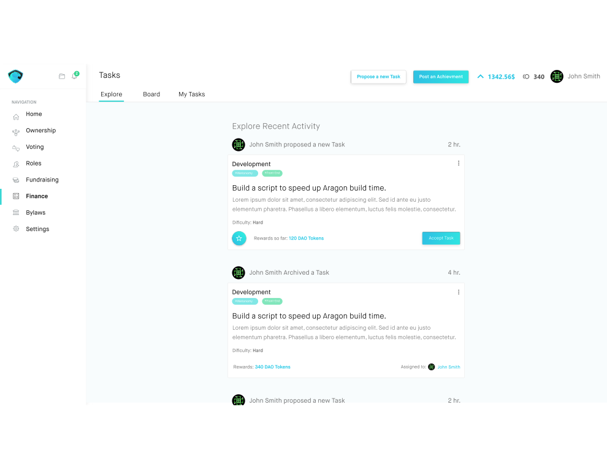
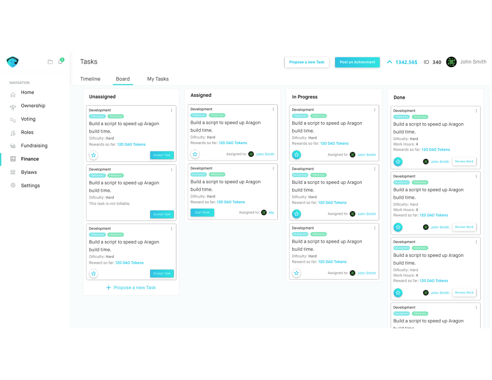
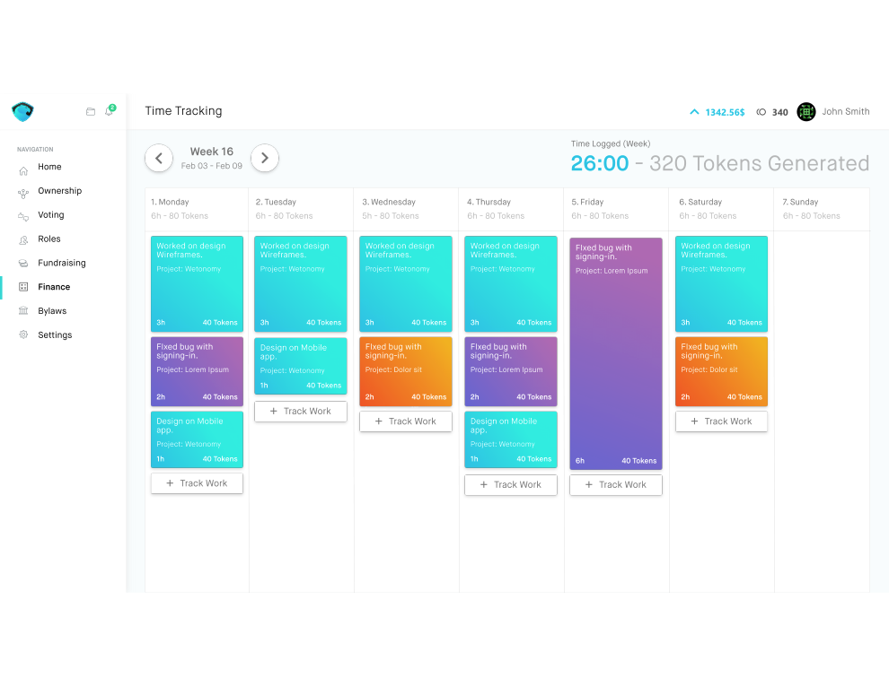
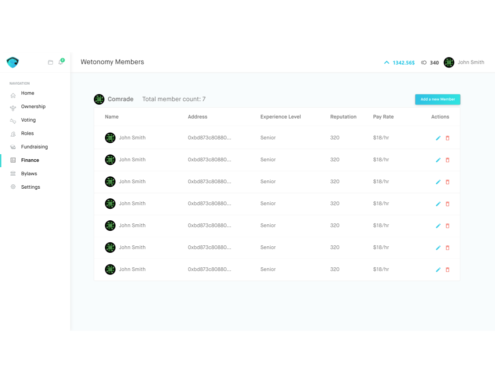

# Wetonomy [](https://travis-ci.com/comrade-coop/wetonomy)

Toolkit built on top of AragonOS that will give teams, companies, and organizations the ability to collaborate, share profits, finance ideas and award contributions, all governed by smart contracts on the blockchain.

Wetonomy implements an innovative solution called High-Risk Automated Debt, allowing for a proper incentivizing system for contributors to the future success of the DAO.


## Apps (In progress)
This repository contains the following apps:
- **Tasks**: The assembly point of the tasks in the organization. This is the place where each member can follow the activities inside the DAO, get a task or reward it. The dashboard contains separate screens:
    - **News Feed**: the place to follow all recent activities and act on them:        
        
    - **Board**: visualization of the status of all tasks in the organization:        
        


- **Time Tracking**: Management of the tasks each member has. He/she will be able to add new tasks to the project:
    

- **Members**: Management of the members of an organization. Each member's pay rate is set based on his/her seniority. The reputation is gained based on everyone's performance:
    


## Prerequisites

- [**Aragon**](https://aragon.one/): Aragon Dapp to create and manage decentralized organizations on Ethereum.
- [**Lerna**](https://lernajs.io/): A tool for managing JavaScript projects with multiple packages.  
- [**Solhint**](https://www.npmjs.com/package/solhint): Open source project for linting Solidity code.
- [**Truffle**](https://github.com/trufflesuite/truffle): Used to build and test the contracts 


## Develop

## Kit Usage
These are the steps required to build and run the Wetonomy Kit as a whole.

1. Install separate package dependencies through Lerna:
```sh
npm run bootstrap
```

2. Start a local Devchain with:
```sh
npm run devchain
```

3. In new Terminal run the following command in order to build the separate apps and run them as a Kit:
```sh
npm run start:kit
```

## Run tests
```sh
truffle develop
test
```

### NPM Scripts

- **bootstrap**: Use lerna to bootstrap the apps into packages
- **build**: Compiles the contracts and builds the front-end
- **build:apps**: Build only the apps
- **compile**: Use Solhint to lint the smart contracts
- **lint**: Run lint on contracts
- **publish**: Builds the apps and the contracts and publishes them to IPFS and APM
- **publish:apps**: Publishes the separate apps  
- **start:kit**: Run the whole Kit locally
- **test**: Runs tests for the contracts
- **devchain**: Starts a local Ganache-CLI devchain


### Libraries
- [**@aragon/os**](https://github.com/aragon/aragonos): Aragon interfaces
- [**@aragon/client**](https://github.com/aragon/aragon.js/tree/master/packages/aragon-client): Wrapper for Aragon application RPC
- [**@aragon/ui**](https://github.com/aragon/aragon-ui): Aragon UI components (in React)
